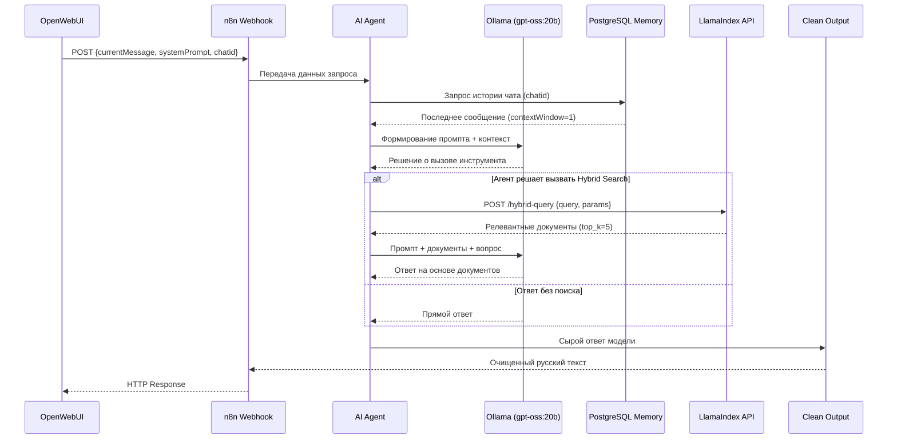

# AI Local Agent (LlamaIndex) — Анализ Архитектуры

## 📋 Общая Информация

| Параметр | Значение |
|----------|----------|
| **Название** | AI local agent (LlamaIndex) |
| **ID Workflow** | RNYHVhxQDDwYZ2Vc |
| **Статус** | Active |
| **Количество узлов** | 7 |
| **Версия API** | v1 |

---

## 🏗️ Архитектура Workflow

### Визуальная Схема Потока Данных

```
                                    ┌──────────────────────┐
                                    │   Ollama Chat Model  │
                                    │     (gpt-oss:20b)    │
                                    └──────────┬───────────┘
                                               │ ai_languageModel
                                               ▼
┌─────────┐   main   ┌──────────┐   main   ┌──────────────┐   main   ┌─────────────────────┐
│ Webhook │ ───────► │ AI Agent │ ───────► │ Clean Output │ ───────► │ Respond to Webhook  │
└─────────┘          └──────────┘          └──────────────┘          └─────────────────────┘
                           ▲
                           │ ai_memory
                     ┌─────┴─────┐
                     │  Postgres │
                     │Chat Memory│
                     └───────────┘
                           ▲
                           │ ai_tool
              ┌────────────┴────────────┐
              │   Hybrid Search Tool    │
              │  (HTTP → LlamaIndex)    │
              └─────────────────────────┘
```

---

## 🔧 Детальное Описание Узлов

### 1. Webhook (Точка Входа)

| Параметр | Значение |
|----------|----------|
| **Тип** | n8n-nodes-base.webhook |
| **Версия** | 2.1 |
| **HTTP Метод** | POST |
| **Путь** | `/835ac6af-d2ac-4208-9f5f-8e45cd161090` |
| **Режим ответа** | lastNode (ответ от последнего узла) |

**Функция:**  
Принимает POST-запросы от OpenWebUI (AI-ассистент Clone). Ожидаемая структура входных данных:
```json
{
  "body": {
    "currentMessage": "Вопрос пользователя",
    "systemPrompt": "Системный промпт",
    "chatid": "идентификатор чата"
  }
}
```

---

### 2. AI Agent (Центральный Агент)

| Параметр | Значение |
|----------|----------|
| **Тип** | @n8n/n8n-nodes-langchain.agent |
| **Версия** | 2.2 |
| **Prompt Type** | define |
| **Batch Size** | 4 |
| **Delay Between Batches** | 100ms |

**Конфигурация:**
- **Текст промпта:** `={{ $json.body.currentMessage }}` — динамически передаётся сообщение пользователя
- **Системное сообщение:** `={{ $json.body.systemPrompt }}` — системный промпт из OpenWebUI

**Подключённые компоненты:**
- 🧠 Language Model: Ollama Chat Model
- 💾 Memory: Postgres Chat Memory  
- 🔧 Tool: Hybrid Search Tool

---

### 3. Ollama Chat Model (Языковая Модель)

| Параметр | Значение |
|----------|----------|
| **Тип** | @n8n/n8n-nodes-langchain.lmChatOllama |
| **Версия** | 1 |
| **Модель** | `gpt-oss:20b` |
| **Temperature** | 0.3 |
| **Use MLock** | true |

**Особенности:**
- Низкая температура (0.3) обеспечивает более детерминированные и точные ответы
- MLock предотвращает выгрузку модели из RAM, ускоряя inference

---

### 4. Postgres Chat Memory (Память Чата)

| Параметр | Значение |
|----------|----------|
| **Тип** | @n8n/n8n-nodes-langchain.memoryPostgresChat |
| **Версия** | 1.3 |
| **Session ID Type** | customKey |
| **Session Key** | `{{ $json.chatid }}` |
| **Context Window Length** | 1 |

**⚠️ Критический момент:**  
`contextWindowLength: 1` означает, что в контекст передаётся **только одно предыдущее сообщение**. Это сильно ограничивает способность агента вести связный диалог.

---

### 5. Hybrid Search Tool (Инструмент Гибридного Поиска) ⭐

| Параметр | Значение |
|----------|----------|
| **Тип** | @n8n/n8n-nodes-langchain.toolHttpRequest |
| **Версия** | 1.1 |
| **URL** | `http://llamaindex:8000/hybrid-query` |
| **Метод** | POST |

**Тело запроса:**
```json
{
  "query": "{query}",
  "match_count": 40,
  "top_k": 5,
  "full_text_weight": 3.0,
  "semantic_weight": 1.0,
  "use_reranking": true
}
```

**Параметры поиска:**
| Параметр | Значение | Описание |
|----------|----------|----------|
| `match_count` | 40 | Количество кандидатов для предварительной выборки |
| `top_k` | 5 | Финальное количество результатов после reranking |
| `full_text_weight` | 3.0 | Вес полнотекстового (BM25) поиска |
| `semantic_weight` | 1.0 | Вес семантического (vector) поиска |
| `use_reranking` | true | Использовать BGE-reranker |

**Описание placeholder:**
> "Поисковый запрос для поиска в базе знаний"

---

### 6. Clean Output (Постобработка)

| Параметр | Значение |
|----------|----------|
| **Тип** | n8n-nodes-base.code |
| **Версия** | 2 |
| **Язык** | JavaScript |

**Алгоритм очистки:**

1. **Поиск явных маркеров ответа:**
   - `Ответ:`, `Итак,`, `Результат:`
   - `So answer:`, `Provide answer:`, `Let's craft answer:`

2. **Определение начала русского текста:**
   - Анализ соотношения кириллицы и латиницы в строках
   - Начало ответа = первая строка с преобладанием кириллицы

3. **Удаление остаточных паттернов:**
   - `[source...]`, `(citation...)`
   - `Use bullet list`, `Cite sources`

4. **Очистка форматирования:**
   - Удаление лишних переносов строк
   - Trimming пробелов

5. **Fallback:**
   - Если нет русского текста: `"К сожалению, релевантная информация не найдена в базе знаний."`

---

### 7. Respond to Webhook (Ответ)

| Параметр | Значение |
|----------|----------|
| **Тип** | n8n-nodes-base.respondToWebhook |
| **Версия** | 1.1 |
| **Формат ответа** | text |
| **Content-Type** | application/json |

---

## 🔄 Процесс Работы (Flow)



---

## 📊 Особенности Архитектуры

### Преимущества

| Аспект | Описание |
|--------|----------|
| **Гибридный поиск** | Комбинирует BM25 (full-text) и семантический поиск с настраиваемыми весами |
| **Reranking** | BGE-reranker повышает релевантность финальных результатов |
| **Централизованный API** | LlamaIndex предоставляет единую точку для поиска |
| **Постобработка** | Очистка Chain-of-Thought reasoning от финального ответа |

### Потенциальные Проблемы

| Проблема | Влияние | Решение |
|----------|---------|---------|
| `contextWindowLength: 1` | Агент "забывает" контекст диалога | Увеличить до 5-10 |
| Фиксированные веса поиска | Не адаптируется под тип запроса | Динамическая настройка |
| Одинаковый top_k для всех запросов | Простые вопросы получают избыточный контекст | Адаптивный top_k |
| Отсутствие fallback при ошибке LlamaIndex | Workflow падает при недоступности сервиса | Добавить error handling |

---

## 🔗 Внешние Зависимости

| Сервис | Эндпоинт | Назначение |
|--------|----------|------------|
| **Ollama** | Configured via credentials | LLM inference |
| **PostgreSQL** | Configured via credentials | Chat history storage |
| **LlamaIndex API** | `http://llamaindex:8000/hybrid-query` | RAG, Hybrid Search, Reranking |

---

## 📈 Метрики и Мониторинг

**Рекомендуемые метрики для отслеживания:**

1. **Latency components:**
   - Webhook → AI Agent: ~10-50ms
   - AI Agent → Ollama (first token): ~500-2000ms
   - Hybrid Search API call: ~200-1000ms
   - Total response time: ~2-5s

2. **Quality metrics:**
   - % вызовов Hybrid Search Tool
   - % ответов "информация не найдена"
   - Средний размер контекста

---

## 🎯 Рекомендации по Улучшению

### Критические (Высокий Приоритет)

1. **Увеличить Context Window Length**
   ```
   Текущее: 1
   Рекомендуемое: 5-10
   ```
   Позволит агенту лучше понимать контекст диалога.

2. **Добавить Error Handling для LlamaIndex**
   ```
   Добавить IF-узел после Hybrid Search Tool
   для обработки ошибок сети/сервиса
   ```

### Средний Приоритет

3. **Улучшить описание инструмента**
   ```
   Текущее: "Поисковый запрос для поиска в базе знаний"
   Рекомендуемое: "Инструмент для поиска информации в корпоративной 
   базе знаний. Используй когда пользователь спрашивает о 
   [конкретные темы]. НЕ используй для общих вопросов."
   ```

4. **Динамический top_k на основе типа запроса**
   - Простые вопросы: top_k=3
   - Сложные вопросы: top_k=7-10

### Низкий Приоритет

5. **Кэширование частых запросов**
6. **A/B тестирование параметров поиска**

---

*Документ создан: 2026-01-13*  
*Версия анализа: 1.0*
