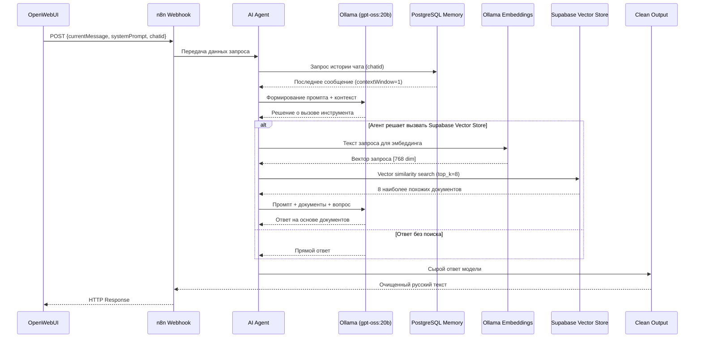

# AI Local Agent (Supabase) — Анализ Архитектуры

## 📋 Общая Информация

| Параметр | Значение |
|----------|----------|
| **Название** | AI local agent (Supabase) |
| **ID Workflow** | RNYHVhxQDDwYZ2Vc |
| **Статус** | Active |
| **Количество узлов** | 8 |
| **Версия API** | v1 |

---

## 🏗️ Архитектура Workflow

### Визуальная Схема Потока Данных

```
                                    ┌──────────────────────┐
                                    │   Ollama Chat Model  │
                                    │     (gpt-oss:20b)    │
                                    └──────────┬───────────┘
                                               │ ai_languageModel
                                               ▼
┌─────────┐   main   ┌──────────┐   main   ┌──────────────┐   main   ┌─────────────────────┐
│ Webhook │ ───────► │ AI Agent │ ───────► │ Clean Output │ ───────► │ Respond to Webhook  │
└─────────┘          └──────────┘          └──────────────┘          └─────────────────────┘
                           ▲
                           │ ai_memory
                     ┌─────┴─────┐
                     │  Postgres │
                     │Chat Memory│
                     └───────────┘
                           ▲
                           │ ai_tool
              ┌────────────┴────────────┐
              │  Supabase Vector Store  │
              │      (Native n8n)       │
              └────────────┬────────────┘
                           │ ai_embedding
              ┌────────────┴────────────┐
              │   Embeddings Ollama     │
              │  (nomic-embed-text)     │
              └─────────────────────────┘
```

---

## 🔧 Детальное Описание Узлов

### 1. Webhook (Точка Входа)

| Параметр | Значение |
|----------|----------|
| **Тип** | n8n-nodes-base.webhook |
| **Версия** | 2.1 |
| **HTTP Метод** | POST |
| **Путь** | `/835ac6af-d2ac-4208-9f5f-8e45cd161090` |
| **Режим ответа** | lastNode |

**Функция:**  
Идентичен LlamaIndex-варианту. Принимает POST-запросы от OpenWebUI.

---

### 2. AI Agent (Центральный Агент)

| Параметр | Значение |
|----------|----------|
| **Тип** | @n8n/n8n-nodes-langchain.agent |
| **Версия** | 2.2 |
| **Prompt Type** | define |
| **Batch Size** | 4 |
| **Delay Between Batches** | 100ms |

**Подключённые компоненты:**
- 🧠 Language Model: Ollama Chat Model
- 💾 Memory: Postgres Chat Memory  
- 🔧 Tool: Supabase Vector Store (вместо HTTP Tool)

---

### 3. Ollama Chat Model (Языковая Модель)

| Параметр | Значение |
|----------|----------|
| **Модель** | `gpt-oss:20b` |
| **Temperature** | 0.3 |
| **Use MLock** | true |

Идентичен LlamaIndex-варианту.

---

### 4. Postgres Chat Memory (Память Чата)

| Параметр | Значение |
|----------|----------|
| **Session Key** | `{{ $json.chatid }}` |
| **Context Window Length** | 1 |

Идентичен LlamaIndex-варианту. **Та же проблема с ограниченным контекстом.**

---

### 5. Supabase Vector Store (Инструмент Поиска) ⭐

| Параметр | Значение |
|----------|----------|
| **Тип** | @n8n/n8n-nodes-langchain.vectorStoreSupabase |
| **Версия** | 1.3 |
| **Режим** | `retrieve-as-tool` |
| **Таблица** | `data_llamaindex_vectors` |
| **Top K** | 8 |

**Описание инструмента:**
> "Используй этот инструмент для поиска знаний по всем пользовательским вопросам"

**Особенности:**
- Использует нативный n8n-интегрированный Vector Store
- Работает напрямую с Supabase без промежуточного API
- **Только семантический поиск** (без BM25/hybrid)

---

### 6. Embeddings Ollama (Модель Эмбеддингов)

| Параметр | Значение |
|----------|----------|
| **Тип** | @n8n/n8n-nodes-langchain.embeddingsOllama |
| **Версия** | 1 |
| **Модель** | `nomic-embed-text:latest` |

**Функция:**  
Генерирует векторные представления для поисковых запросов пользователя.

**Характеристики модели nomic-embed-text:**
- Размерность: 768
- Контекст: до 8192 токенов
- Хорошая поддержка многоязычности

---

### 7. Clean Output (Постобработка)

Идентичен LlamaIndex-варианту. Тот же JavaScript код для очистки.

---

### 8. Respond to Webhook (Ответ)

Идентичен LlamaIndex-варианту.

---

## 🔄 Процесс Работы (Flow)



---

## 📊 Сравнение с LlamaIndex-вариантом

| Аспект | Supabase Workflow | LlamaIndex Workflow |
|--------|-------------------|---------------------|
| **Тип поиска** | Только семантический | Гибридный (BM25 + Semantic) |
| **Reranking** | ❌ Нет | ✅ BGE-reranker |
| **Эмбеддинги** | Ollama (nomic-embed-text) | LlamaIndex API (внутренний) |
| **Количество результатов** | 8 (top_k) | 5 (после reranking) |
| **Внешние зависимости** | Меньше (нет LlamaIndex) | Требует LlamaIndex API |
| **Гибкость настройки** | Ограничена | Высокая (параметры поиска) |
| **Точность для ключевых слов** | 🔻 Ниже | 🔺 Выше (BM25) |
| **Латентность** | Быстрее (~200ms меньше) | Медленнее (2 этапа поиска) |

---

## 🔍 Глубокий Анализ Проблем

### 1. Только Семантический Поиск

**Проблема:**  
При использовании только vector similarity search, запросы с точными терминами или именами могут не находить релевантные документы.

**Пример:**
- Запрос: "Где находится офис компании ABC?"
- Семантический поиск может не найти документ с точным упоминанием "ABC"
- BM25 (keyword) поиск нашёл бы напрямую

### 2. Отсутствие Reranking

**Проблема:**  
Top-8 документов возвращаются напрямую без переранжирования. Среди них могут быть "семантически близкие", но не релевантные.

**Влияние:**
- Больший контекст (8 vs 5) → медленнее LLM inference
- Потенциально больше "шума" в контексте

### 3. Прямая Зависимость от Структуры Таблицы

**Проблема:**  
Узел Supabase Vector Store работает с таблицей `data_llamaindex_vectors`. Если структура изменится (добавление metadata, изменение схемы), потребуется модификация workflow.

---

## 📈 Метрики Производительности

| Метрика | Ожидаемое Значение |
|---------|-------------------|
| Webhook → AI Agent | ~10-50ms |
| Embedding Generation | ~50-150ms |
| Supabase Vector Search | ~100-300ms |
| LLM First Token | ~500-2000ms |
| Total Response Time | ~1.5-4s |

**Преимущество по latency:**  
~200-500ms быстрее LlamaIndex-варианта за счёт отсутствия HTTP-вызова к внешнему API.

---

## 🎯 Рекомендации по Улучшению

### Критические (Высокий Приоритет)

1. **Увеличить Context Window Length**
   ```
   Текущее: 1
   Рекомендуемое: 5-10
   ```

2. **Добавить MMR (Maximal Marginal Relevance)**
   ```
   Если доступно в настройках Supabase Vector Store,
   включить MMR для разнообразия результатов
   ```

### Средний Приоритет

3. **Уменьшить top_k и улучшить качество**
   ```
   Текущее: top_k=8
   Рекомендуемое: top_k=5 с улучшенными embeddings
   ```
   Меньше документов = быстрее LLM + меньше шума

4. **Улучшить описание инструмента**
   ```
   Текущее: "Используй этот инструмент для поиска знаний 
             по всем пользовательским вопросам"
   
   Рекомендуемое: "Инструмент для поиска в корпоративной базе знаний.
   КОГДА использовать:
   - Вопросы о продуктах, услугах, процедурах
   - Запросы требующие актуальной информации
   КОГДА НЕ использовать:
   - Общие вопросы (приветствия, погода)
   - Математические расчёты
   - Вопросы о тебе как об ИИ"
   ```

5. **Рассмотреть переход на LlamaIndex-вариант**
   ```
   Если качество ответов критично важнее скорости,
   рекомендуется использовать LlamaIndex с гибридным поиском
   ```

### Низкий Приоритет

6. **Мониторинг качества эмбеддингов**
   - Сравнить nomic-embed-text с multilingual-e5-large
   - Протестировать на benchmark'е с русскоязычными запросами

7. **Добавить Metadata Filtering**
   - Фильтрация по категориям документов
   - Фильтрация по дате

---

## 🔗 Внешние Зависимости

| Сервис | Эндпоинт | Назначение |
|--------|----------|------------|
| **Ollama** | Configured via credentials | LLM + Embeddings |
| **PostgreSQL** | Configured via credentials | Chat history |
| **Supabase** | Configured via credentials | Vector storage |

---

## ⚖️ Когда Использовать Этот Workflow

### ✅ Рекомендуется когда:
- Скорость ответа критична
- Запросы преимущественно семантические (не точные термины)
- Инфраструктура минималистична (без LlamaIndex API)
- Нужна простота поддержки

### ❌ Не рекомендуется когда:
- Запросы содержат точные названия/термины
- Качество ответов важнее скорости
- Документы сильно пересекаются по семантике

---

*Документ создан: 2026-01-13*  
*Версия анализа: 1.0*
